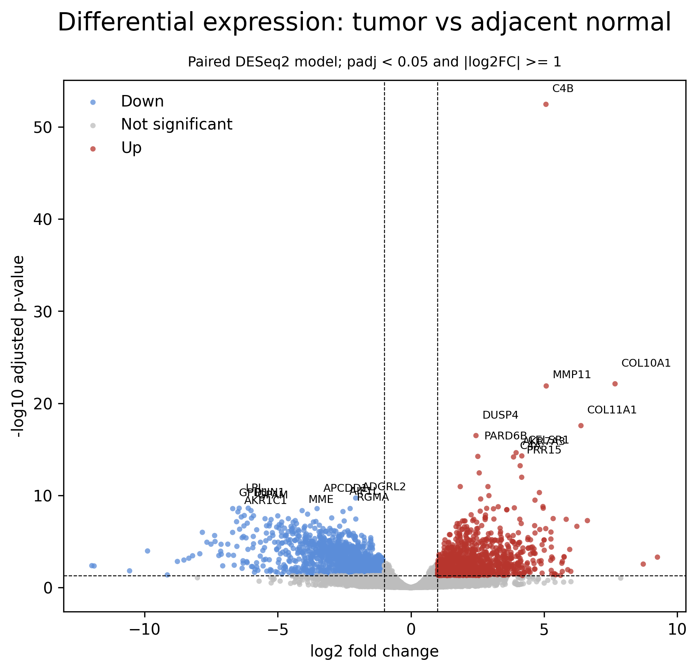
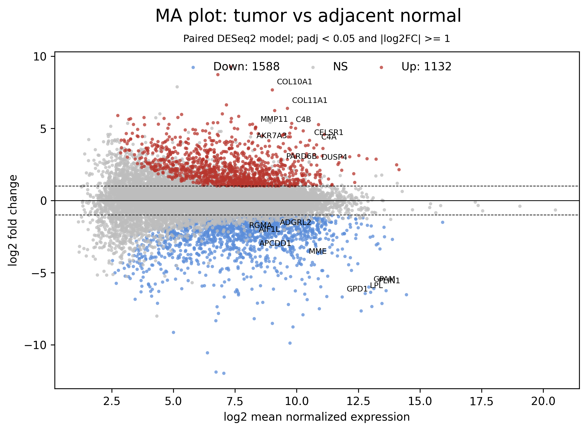
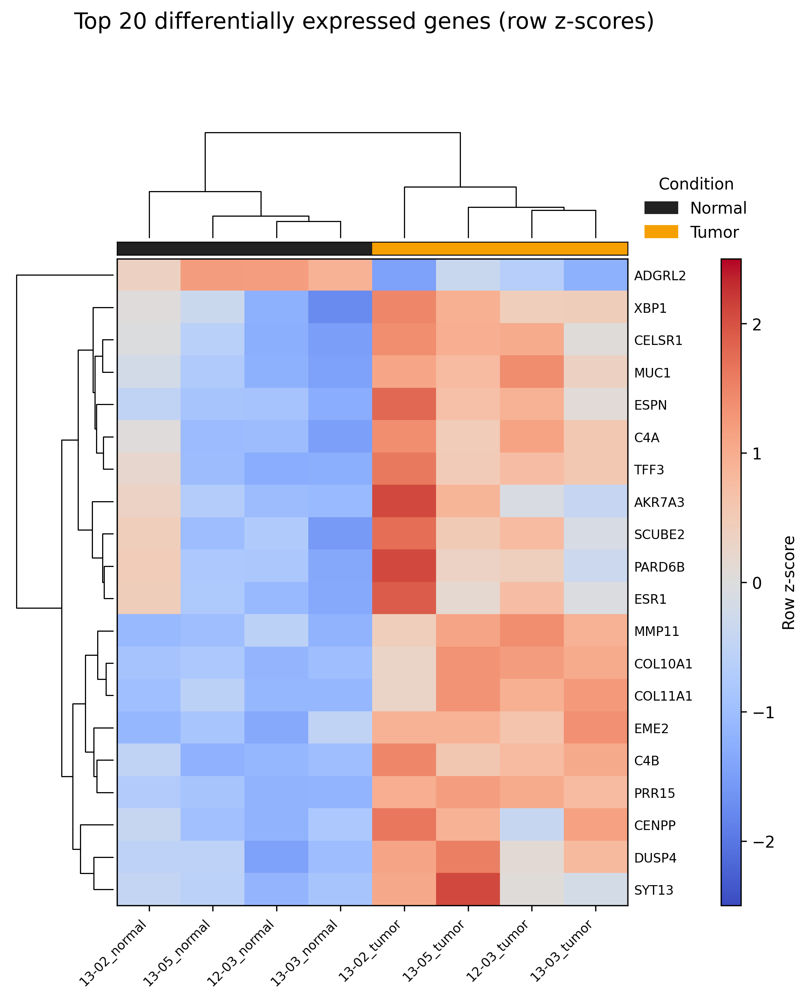

# Abstract

This project reproduces a scaled-down gene-level analysis of the GSE103001
breast cancer RNA-seq dataset. Four patients were selected, providing four
estrogen receptor-positive (ER+) tumors and four matched adjacent
non-malignant tissues. Reads were quality controlled, trimmed, quantified
against a current GRCh38 Ensembl transcriptome with Salmon, aggregated to the
gene level, and analyzed with a paired DESeq2 model. After filtering, 17,729
genes were tested and 3,393 were differentially expressed at an adjusted
*p*-value below 0.05. Using the additional effect-size criterion
|log2 fold change| >= 1, 1,267 genes were upregulated and 1,704 were
downregulated in tumors. Gene Ontology enrichment highlighted
extracellular-matrix organization, adhesion, junctions, and growth-factor
signaling.
These results identify extensive tumor-associated transcriptional remodeling,
although the low Salmon mapping rate and the small four-patient cohort limit
the strength and generalizability of the conclusions.

# 1. Objective

The aim was to compare ER+ breast tumors with adjacent non-malignant mammary
tissue from the same patients. The workflow follows the assignment
requirements:

1. retrieve eight RNA-seq samples corresponding to four matched pairs;
2. perform read-level quality control and trimming;
3. quantify transcript abundance using Salmon and a GRCh38 transcriptome;
4. perform paired differential expression analysis;
5. test significant genes for functional enrichment;
6. compare the gene-level results and computational approach with the
   conclusions of the original study.

The analysis intentionally focuses on gene-level differential expression. It
does not attempt to reproduce the complete strand-specific natural antisense
transcript analysis from the original publication.

# 2. Materials and methods

## 2.1 Dataset and paired design

Raw sequencing data were obtained from GEO series **GSE103001**, SRA study
**SRP116023**. The four selected patients were 12-03, 13-02, 13-03, and 13-05.
Each contributed one tumor and one adjacent non-malignant sample:

| Patient | Normal run | Tumor run |
|---|---|---|
| 12-03 | SRR5962199 | SRR5962221 |
| 13-02 | SRR5962200 | SRR5962222 |
| 13-03 | SRR5962201 | SRR5962223 |
| 13-05 | SRR5962202 | SRR5962224 |

The matched structure was retained in the statistical model so that
inter-patient variability was not incorrectly treated as part of the
tumor-versus-normal effect.

## 2.2 Quality control and preprocessing

FastQC was run before and after preprocessing. Reads were filtered and trimmed
with fastp, and the reports were summarized with MultiQC. Across the eight
samples, fastp retained **95.9–99.3%** of reads (mean 97.7%). The post-filtering
Q30 rate ranged from **80.7% to 96.6%**.

| Run | Reads retained | Post-filter Q30 |
|---|---:|---:|
| SRR5962199 | 95.9% | 80.7% |
| SRR5962200 | 97.4% | 96.5% |
| SRR5962201 | 97.9% | 96.5% |
| SRR5962202 | 99.2% | 89.8% |
| SRR5962221 | 96.4% | 82.9% |
| SRR5962222 | 98.1% | 96.5% |
| SRR5962223 | 97.1% | 96.6% |
| SRR5962224 | 99.3% | 89.7% |

## 2.3 Salmon quantification and gene aggregation

The processed paired-end reads were quantified with Salmon using automatic
library-type detection and an index constructed from the Ensembl release 115
GRCh38 cDNA transcriptome. Transcript identifiers were mapped to Ensembl gene
identifiers from the transcriptome FASTA headers. Transcript-level
`NumReads` and TPM values were summed per gene to construct the gene count and
gene TPM matrices.

The Salmon mapping rate ranged from **12.7% to 44.2%**, with a mean of
**29.9%**.

| Run | Salmon mapping rate |
|---|---:|
| SRR5962199 | 12.7% |
| SRR5962200 | 33.1% |
| SRR5962201 | 44.2% |
| SRR5962202 | 26.1% |
| SRR5962221 | 15.4% |
| SRR5962222 | 34.9% |
| SRR5962223 | 34.2% |
| SRR5962224 | 38.4% |

This relatively low mapping rate is an important limitation. The original
libraries were generated from ribosomal-RNA-depleted total RNA, whereas the
index used here contained cDNA transcripts only. Intronic, intergenic,
unannotated, and residual non-coding reads therefore cannot be represented
well by this reference. A decoy-aware Salmon index or genome-alignment
workflow would be expected to account for a larger fraction of reads.

## 2.4 Differential expression analysis

Genes were retained when they had at least 10 counts in at least two samples.
DESeq2 was run using:

```text
design = ~ patient + condition
contrast = tumor versus normal
```

The normal samples were used as the reference condition. Benjamini-Hochberg
adjusted *p*-values below 0.05 were considered significant. For plot
classification and effect-size summaries, a second threshold of
|log2 fold change| >= 1 was used.

Variance-stabilized expression values were used for clustering and the
heatmap. The heatmap displays row-wise z-scores for the 20 genes with the
smallest adjusted *p*-values.

## 2.5 Functional enrichment

GO over-representation analysis was performed using the significant DESeq2
genes. The tested-gene background was restricted to genes present in the
differential expression results. GO Biological Process, Molecular Function,
and Cellular Component terms were tested, with adjusted *p* < 0.05 used as the
significance threshold.

# 3. Results

## 3.1 Differential expression

After count filtering, **17,729 genes** were included in DESeq2. A total of
**3,393 genes** had adjusted *p* < 0.05. Among these, **2,971 genes** also had
|log2 fold change| >= 1:

- 1,267 upregulated in tumor;
- 1,704 downregulated in tumor.

The large number of detected genes indicates a strong expression difference
between tumor and adjacent tissue. However, with only four pairs, effect
estimates and the number of discoveries remain sensitive to individual
patients, tissue composition, and the quantification limitations described
above.

Selected strongly upregulated genes included **MMP11**, **ESR1**, **GALNT7**,
**COL11A1**, **CA12**, **COL10A1**, **MKI67**, and **SCUBE2**. MMP11 and the
collagen genes are consistent with extracellular-matrix and tumor-stroma
remodeling, while ESR1, CA12, and SCUBE2 are compatible with the ER+ phenotype.

Selected strongly downregulated genes included **TNS1**, **ACSL1**, **CAVIN1**,
**PDK4**, **ALDH2**, **SLC16A7**, **AQP1**, **ANGPT1**, **CFD**, and **VIM**.
Several of these genes are associated with metabolism, vascular or stromal
components, and normal mammary/adipose tissue. Their lower abundance in tumor
samples may therefore reflect both cancer-cell regulation and changes in
cellular composition.



Red points are upregulated and blue points are downregulated in tumor. Grey
points do not pass both the statistical and effect-size thresholds.



Significant genes are distributed across a broad range of mean expression
values. The asymmetry toward negative fold changes is consistent with the
larger number of downregulated genes.

## 3.2 Expression heatmap

Hierarchical clustering of the top 20 differentially expressed genes separated
the four tumor samples from the four adjacent non-malignant samples. The
top-ranked set included **MMP11**, **COL11A1**, **COL10A1**, **ESR1**,
**SCUBE2**, **TOP2A**, and **MKI67**.



Values are row-wise z-scores of log-transformed normalized counts. Columns and
rows were hierarchically clustered. The upper annotation identifies tumor and
normal samples.

## 3.3 Gene Ontology enrichment

The enrichment analysis tested 7,917 GO terms and identified **794 significant
terms** at adjusted *p* < 0.05. The strongest results involved extracellular
matrix, adhesion, epithelial junctions, hormone responses, and receptor
signaling.

| GO term | GO identifier | Overlap | Fold enrichment | Adjusted *p* |
|---|---|---:|---:|---:|
| Extracellular matrix | GO:0031012 | 176 | 1.80 | 1.74 x 10^-14 |
| External encapsulating structure | GO:0030312 | 176 | 1.80 | 1.74 x 10^-14 |
| Collagen-containing extracellular matrix | GO:0062023 | 143 | 1.88 | 1.87 x 10^-13 |
| Apical junction complex | GO:0043296 | 66 | 2.18 | 4.40 x 10^-9 |
| Cell-substrate adhesion | GO:0031589 | 126 | 1.73 | 1.15 x 10^-7 |
| Cellular response to peptide hormone stimulus | GO:0071375 | 118 | 1.76 | 1.15 x 10^-7 |
| PDGF receptor signaling pathway | GO:0048008 | 50 | 2.42 | 1.23 x 10^-7 |
| Response to peptide hormone | GO:0043434 | 145 | 1.64 | 1.23 x 10^-7 |
| Bicellular tight junction | GO:0005923 | 55 | 2.19 | 1.49 x 10^-7 |
| Integrin binding | GO:0005178 | 65 | 2.05 | 6.24 x 10^-7 |

These functions are biologically plausible for breast cancer.
Extracellular-matrix and collagen remodeling can reflect tumor-stroma
reorganization, while altered adhesion, tight junctions, integrin binding,
hormone responses, and growth-factor signaling are relevant to epithelial
tumor behavior. The enrichment analysis was performed on a combined
significant-gene list, so it does not distinguish pathways driven specifically
by upregulated versus downregulated genes.

# 4. Comparison with the original study

The original study by Grélet *et al.* used paired tumor and adjacent
non-malignant tissues and focused on natural antisense transcripts (ncNATs)
and their relationships with protein-coding transcripts. The authors reported
that antisense transcription was globally increased in tumors and that
ncNAT/protein-coding transcript correlations were altered in cancer tissue.
They also identified ncNAT-associated coding genes related to patient survival
and a subset of 72 Cancer Gene Census genes with deregulated ncNAT profiles.

The present analysis addresses a narrower question. It confirms that paired
tumor and adjacent tissues have markedly different gene-level expression
profiles, and it identifies processes expected in cancer, including adhesion,
epithelial junctions, hormone and growth-factor responses, and
extracellular-matrix remodeling. These observations are compatible with the
original paper's conclusion that tumor tissue undergoes substantial
transcriptional reorganization.

The enrichment results are not directly equivalent to those in the paper.
The publication tested specialized ncNAT/protein-coding gene-pair lists and
reported no clear pathway enrichment for those lists. This project instead
tests the much larger set of gene-level tumor-versus-normal DEGs, making
significant cancer-related GO enrichment more likely. Therefore, the
enrichment results should be interpreted as a characterization of the global
tumor expression signature, not as a reproduction of the ncNAT-specific
analysis.

# 5. Effect of the modern computational workflow

Several differences can cause the results to diverge from the original
STAR + HTSeq + GRCh37 analysis:

- **Reference assembly and annotation.** GRCh38 has improved sequence,
  corrected regions, alternate loci, and updated gene/transcript definitions.
  Ensembl release 115 also contains transcripts and gene models unavailable
  in the older GRCh37 annotation.
- **Quantification algorithm.** Salmon estimates transcript abundance using
  probabilistic quasi-mapping and resolves multi-mapping reads differently
  from genome alignment followed by HTSeq counting.
- **Transcript-to-gene aggregation.** Summing Salmon estimated counts assigns
  ambiguous transcript evidence probabilistically, whereas HTSeq commonly
  discards or handles ambiguous genomic overlaps according to a counting mode.
- **Transcriptome-only index.** The current index does not contain genomic
  decoys or intronic/intergenic sequence. This is particularly relevant for
  ribo-depleted total RNA and probably contributes to the low mapping rates.
- **Sample number.** Only four of the original matched pairs were analyzed.
  This reduces statistical power and makes the result more sensitive to
  patient-specific effects.
- **Analysis scope.** The current workflow is gene-level and not
  strand-specific at the ncNAT/protein-coding pair level.

Consequently, exact agreement in DEG identities, fold changes, or pathway
results should not be expected. Agreement at the level of broad tumor biology
is a more appropriate comparison.

# 6. Limitations and possible improvements

The principal limitations are:

1. only four matched pairs were used;
2. Salmon mapping rates were low and variable;
3. cellular composition was not modeled;
4. no fold-change shrinkage was applied before ranking or visualization;
5. GO enrichment combined upregulated and downregulated genes;
6. the analysis did not reproduce strand-specific ncNAT quantification.

A stronger follow-up would use all available matched pairs, construct a
decoy-aware Salmon index from the GRCh38 genome and transcriptome, verify the
library strandedness, apply `lfcShrink`, and perform separate enrichment for
upregulated and downregulated genes or a ranked-list method such as GSEA.

# 7. Conclusion

The paired DESeq2 analysis detected a strong gene-expression difference
between ER+ breast tumors and adjacent non-malignant tissue. The top genes and
GO terms indicate changes in extracellular-matrix organization, adhesion,
epithelial junctions, hormone responses, metabolism, and signaling. These
results support the broad conclusion that breast tumors undergo extensive
transcriptional remodeling, while the small sample size and low mapping rate
require cautious interpretation. The workflow satisfies the assignment's
gene-level objective but should not be considered a direct reproduction of
the original paper's ncNAT-specific analysis.

# 8. Reproducibility and deliverables

The complete analysis pipeline and the scripts used for data acquisition,
quality control, Salmon quantification, DESeq2 analysis, visualization, and GO
enrichment are available in the `Project` directory. The main commands are:

```bash
make prepare-dea
make dea
make plots
make enrichment
```

The principal deliverables requested by the assignment are:

- short report: `report/Part1_Report_Barra.md`;
- scripts: `main.py`, the Python workflow modules, and the R scripts under
  `DifferentialExpression/scripts` and `Enrichment/scripts`;
- complete DEG table: `data/GSE103001/de/results/deseq2_all_genes.csv`;
- significant DEG table:
  `data/GSE103001/de/results/deseq2_significant_genes_padj_0.05.csv`;
- enrichment results:
  `data/GSE103001/enrichment/go_overrepresentation_significant.csv`;
- main figures: the volcano plot, MA plot, PCA, sample-distance heatmap, and
  top-gene heatmap under `data/GSE103001/de/results`.

# References

1. Grélet S, et al. *Transcriptome-wide analysis of natural antisense
   transcripts shows their potential role in breast cancer*. Scientific
   Reports. 2017;7:17452. doi:10.1038/s41598-017-17811-2.
2. Patro R, Duggal G, Love MI, Irizarry RA, Kingsford C. *Salmon provides fast
   and bias-aware quantification of transcript expression*. Nature Methods.
   2017;14:417-419.
3. Love MI, Huber W, Anders S. *Moderated estimation of fold change and
   dispersion for RNA-seq data with DESeq2*. Genome Biology. 2014;15:550.
