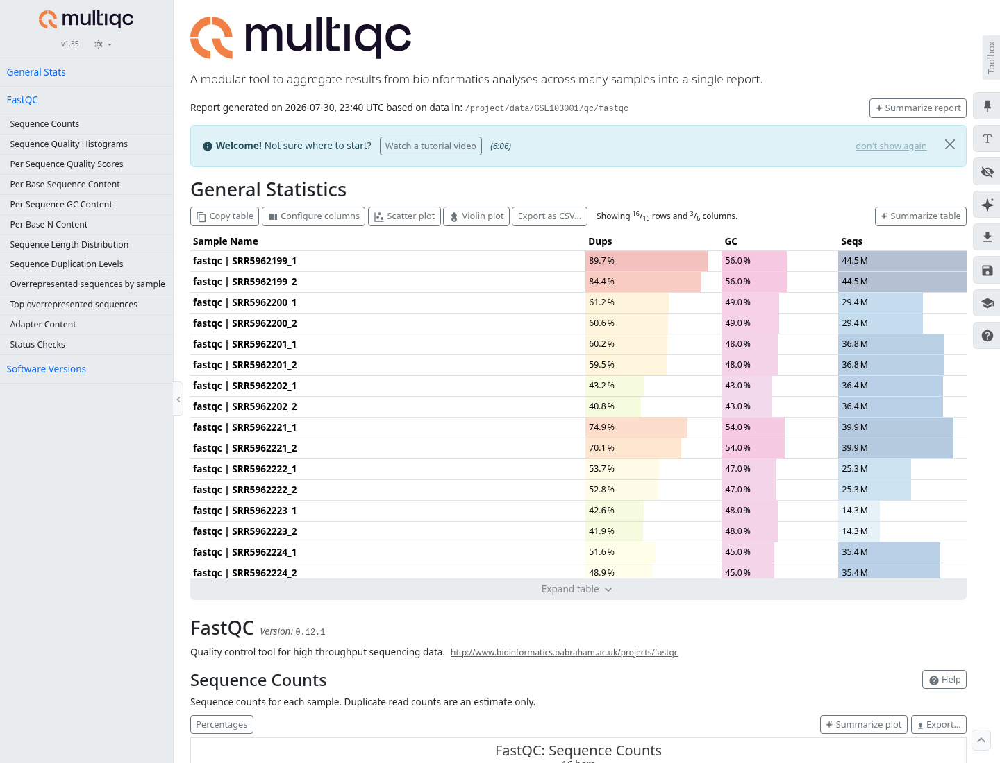
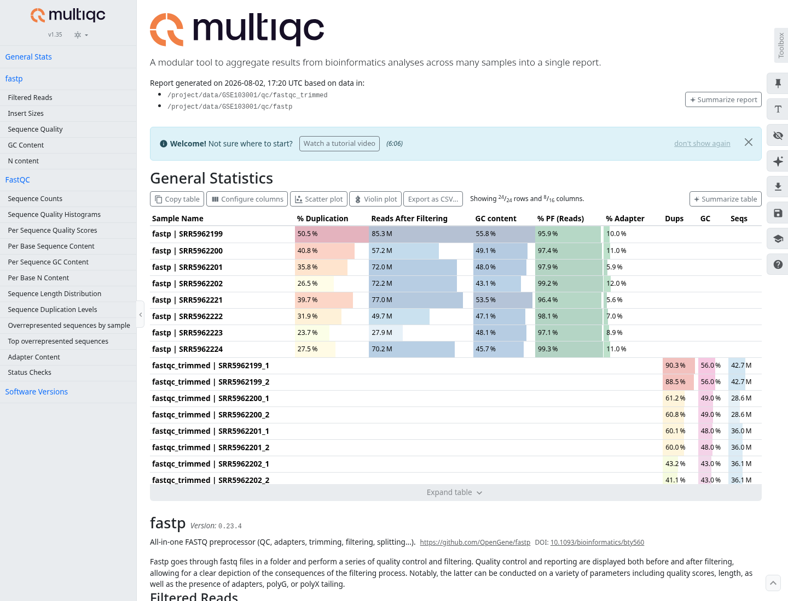

# Abstract

This project reproduces a scaled-down gene-level analysis of the GSE103001
breast cancer RNA-seq dataset. Four patients were selected, providing four
estrogen receptor-positive (ER+) tumors and four matched adjacent
non-malignant tissues. Reads were quality controlled, trimmed, quantified
with Salmon against the fixed, recent Ensembl release 115 GRCh38 cDNA
transcriptome, aggregated to the gene level, and analyzed with a paired DESeq2 model. After
filtering, 17,683 genes were tested and 2,963 were differentially expressed at
an adjusted *p*-value below 0.05. Using the additional effect-size criterion
|log2 fold change| >= 1, 1,132 genes were upregulated and 1,588 were
downregulated in tumors. Gene Ontology enrichment highlighted
extracellular-matrix organization, adhesion, junctions, and growth-factor
signaling.

# 1. Objective

The aim was to compare ER+ breast tumors with adjacent non-malignant mammary
tissue from the same patients. The workflow follows the assignment
requirements:

1. retrieve eight RNA-seq samples corresponding to four matched pairs;
2. perform read-level quality control and trimming;
3. quantify transcript abundance using Salmon and a GRCh38 transcriptome;
4. perform paired differential expression analysis;
5. test significant genes for functional enrichment;
6. compare the gene-level results and computational approach with the
   conclusions of the original study.

The analysis intentionally focuses on gene-level differential expression. It
does not attempt to reproduce the complete strand-specific natural antisense
transcript analysis from the original publication.

# 2. Materials and methods

## 2.1 Dataset and paired design

Raw sequencing data were obtained from GEO series **GSE103001**, SRA study
**SRP116023**, associated with BioProject **PRJNA399721**. The pipeline
downloaded and parsed the GEO family SOFT metadata, resolved the selected SRX
experiment accessions to SRR runs through NCBI, and retrieved the corresponding
paired FASTQ URLs and MD5 checksums from ENA. It then downloaded 16 compressed
FASTQ files, two mates for each of the eight samples, and validated every file
against its ENA MD5 checksum.

The source libraries were prepared from total RNA using the TruSeq Stranded
Total RNA kit with Ribo-Zero rRNA depletion and were sequenced as paired-end
reads on an Illumina HiSeq 2000. The four selected patients were 12-03, 13-02,
13-03, and 13-05. Each contributed one tumor and one adjacent non-malignant
sample:

Patients were selected programmatically from the GEO metadata by identifying
records with both a tumor and a matched adjacent-normal sample. Patient 12-02
was excluded because its ENA record contained an anomalous mixture of
standalone and paired FASTQ files. The next four complete pairs in
patient-identifier order, 12-03, 13-02, 13-03, and 13-05 were used.

| Patient | Normal run | Tumor run |
|---|---|---|
| 12-03 | SRR5962199 | SRR5962221 |
| 13-02 | SRR5962200 | SRR5962222 |
| 13-03 | SRR5962201 | SRR5962223 |
| 13-05 | SRR5962202 | SRR5962224 |

The matched structure was retained in the statistical model so that
inter-patient variability was not incorrectly treated as part of the
tumor-versus-normal effect.

## 2.2 Quality control and preprocessing

FastQC was run on all 16 input FASTQ files (two mates for each of the eight
samples) before preprocessing, and the reports were aggregated with MultiQC to
identify recurrent problems across samples. The raw data showed variable GC
content and high apparent duplication in several libraries. Duplication was
not removed: in RNA-seq, highly expressed transcripts naturally generate
repeated fragments, so deduplication without UMIs could discard genuine
biological signal.



Reads were then cleaned with fastp in paired-end mode using its default
filtering and automatic paired-read adapter-trimming behavior; these
thresholds were not manually overridden on the command line. Automatic
adapter trimming was retained because the adapter contribution varied between
libraries. Under the default quality filters, bases with Phred score below 15
were considered unqualified; reads were rejected when more than 40% of their
bases were unqualified, when they contained more than five `N` bases, or when
the cleaned read length was below 15 bases. No fixed head or tail crop was
imposed, because FastQC did not justify discarding the same number of bases
from every library.

This moderately conservative strategy was chosen to remove adapter sequence
and clearly unreliable reads while avoiding aggressive trimming that would
shorten reads and reduce Salmon mappability.
FastQC was repeated on all 16 cleaned FASTQ files, and fastp plus post-cleaning
FastQC reports were combined in a second MultiQC report.
Raw and post-cleaning FastQC reports are reused when their HTML and ZIP outputs
are present and the ZIP reports pass structural validation. Existing fastp
outputs are reused when the paired cleaned reads and both reports are present,
and the JSON report contains valid before- and after-filtering read counts.



Across the eight samples, fastp retained **95.9–99.3%** of reads (mean 97.7%).
The post-filtering Q30 rate ranged from **80.7% to 96.6%**.

| Run | Reads retained | Post-filter Q30 |
|---|---:|---:|
| SRR5962199 | 95.9% | 80.7% |
| SRR5962200 | 97.4% | 96.5% |
| SRR5962201 | 97.9% | 96.5% |
| SRR5962202 | 99.2% | 89.8% |
| SRR5962221 | 96.4% | 82.9% |
| SRR5962222 | 98.1% | 96.5% |
| SRR5962223 | 97.1% | 96.6% |
| SRR5962224 | 99.3% | 89.7% |

## 2.3 Salmon quantification and gene aggregation

The processed paired-end reads were quantified with Salmon using automatic
library-type detection (`--libType A`) and selective-alignment validation
(`--validateMappings`). Salmon consistently inferred the inward-stranded
reverse (`ISR`) library type for all eight samples, in agreement with the
strand-specific library preparation. For reproducibility, the reference was
fixed to Ensembl release 115. The Salmon index was constructed from the
[Ensembl release 115 GRCh38 cDNA transcriptome](https://ftp.ensembl.org/pub/release-115/fasta/homo_sapiens/cdna/)
using the default index parameters and contained transcript sequences only: no
GRCh38 genomic decoys were supplied. Transcript identifiers were mapped to
Ensembl gene identifiers from the transcriptome FASTA headers. Salmon
`quant.sf` files were imported
into R with `tximport` and summarized to Ensembl genes using this
transcript-to-gene map. The resulting counts, abundances, and effective
transcript lengths were passed to `DESeqDataSetFromTximport`, allowing DESeq2
to use average transcript-length offsets in addition to library-size
normalization.

The Salmon mapping rate—the percentage of input fragments that Salmon assigned
to annotated transcript sequences—ranged from **12.7% to 44.2%**, with a mean
of **29.9%**.

For reproducibility, the workflow records the indexed transcriptome SHA-256
checksum, Salmon and index versions, and index parameters. Existing Salmon
results are reused only after validating the index, `quant.sf` structure and
numeric values, completion metadata, library type, and mapping statistics. The
reuse check also compares Salmon's embedded index identifiers and SHA-256
checksums for the trimmed reads and core outputs.

| Run | Salmon mapping rate |
|---|---:|
| SRR5962199 | 12.7% |
| SRR5962200 | 33.1% |
| SRR5962201 | 44.2% |
| SRR5962202 | 26.1% |
| SRR5962221 | 15.4% |
| SRR5962222 | 34.9% |
| SRR5962223 | 34.2% |
| SRR5962224 | 38.4% |

This relatively low mapping rate is an important limitation. The original
libraries were generated from ribosomal-RNA-depleted total RNA, whereas the
index used here contained cDNA transcripts only. Reads originating from
intronic, intergenic, unannotated, or residual non-coding sequence therefore
cannot generally be assigned to the annotated transcripts in this reference.
A decoy-aware Salmon index would improve assignment specificity by preventing
reads that match genomic sequence better than an annotated transcript from
being assigned spuriously to that transcript. It would not quantify the decoy
sequences or guarantee a higher transcript mapping rate; the reported rate
could decrease if false transcript assignments were removed. Explicitly
accounting for intronic and intergenic reads would instead require a suitable
genome-alignment workflow or a deliberately expanded reference.

## 2.4 Differential expression analysis

Genes were retained when they had at least 10 counts in at least two samples.
DESeq2 was run using:

```text
design = ~ patient + condition
contrast = tumor versus normal
```

The normal samples were used as the reference condition. DESeq2 adjusted the
gene-level Wald-test *p*-values with the Benjamini-Hochberg (BH) procedure,
which controls the false discovery rate. DESeq2's default independent
filtering was applied before multiple-testing correction, using mean
normalized expression to remove genes with insufficient power; such genes
would have `padj = NA`. In this analysis, all 17,683 genes that passed the
explicit count prefilter received a finite adjusted *p*-value, so independent
filtering did not remove any additional genes. BH-adjusted *p*-values below
0.05 were considered significant. For plot classification and effect-size
summaries, a second threshold of |log2 fold change| >= 1 was used; this
fold-change threshold was not part of the *p*-value adjustment.

Variance-stabilized expression values were calculated with DESeq2 using
`vst(dds, blind = FALSE)`. PCA was computed across all 17,683 genes retained
after count filtering. The same VST matrix was used for sample clustering and
the heatmap; the heatmap displays row-wise z-scores for the 20 genes with the
smallest adjusted *p*-values.

## 2.5 Functional enrichment

GO over-representation analysis was performed on all 2,963 DESeq2 genes with
adjusted *p* < 0.05. Upregulated and downregulated genes were analyzed together,
and the |log2 fold change| >= 1 criterion used for effect-size summaries and
plot classification was not applied to the enrichment input. The tested-gene
background was restricted to the 17,683 genes present in the differential
expression results. Ensembl version suffixes were removed before analysis, and
the identifiers were supplied to `enrichGO` with `keyType = "ENSEMBL"` using
`org.Hs.eg.db`. Because annotation coverage differs by ontology, the effective
background contained 14,948 genes for Biological Process, 15,503 for Molecular
Function, and 15,710 for Cellular Component. These three ontologies were tested
using hypergeometric over-representation tests. The resulting term-level *p*-values were adjusted
with the Benjamini-Hochberg procedure. Because BP, MF, and CC were analyzed in
three separate `enrichGO` calls, BH correction was performed independently
within each ontology rather than once over the combined table. Terms with
BH-adjusted *p* < 0.05 were considered significant.

## 2.6 Software environment

The analysis was run in the project Docker environment based on Bioconductor
release 3.21. The resolved analysis versions were Python 3.12.3, R 4.5.2,
Salmon 1.10.2, fastp 0.23.4, FastQC 0.12.1, MultiQC 1.35, DESeq2 1.48.2,
tximport 1.36.1, clusterProfiler 4.16.0, and org.Hs.eg.db 3.21.0. The current
container recipe additionally pins optparse 1.7.5 for command-line parsing.
The recipe is provided in `Dockerfile` and verifies the principal analysis-tool
versions during the image build. Because the base-image tag and Ubuntu and some
supporting R packages are not locked to immutable artifacts, this verification
detects dependency drift but does not guarantee an identical rebuild indefinitely.

# 3. Results

## 3.1 Differential expression

After count filtering, **17,683 genes** were included in DESeq2. A total of
**2,963 genes** had adjusted *p* < 0.05. Among these, **2,720 genes** also had
|log2 fold change| >= 1:

- 1,132 upregulated in tumor;
- 1,588 downregulated in tumor.

The large number of detected genes indicates a strong expression difference
between tumor and adjacent tissue. However, with only four pairs, effect
estimates and the number of discoveries remain sensitive to individual
patients, tissue composition, and the quantification limitations described
above.

Selected strongly upregulated genes included **MMP11**, **ESR1**, **GALNT7**,
**COL11A1**, **CA12**, **COL10A1**, **MKI67**, and **SCUBE2**. MMP11 and the
collagen genes are consistent with extracellular-matrix and tumor-stroma
remodeling, while ESR1, CA12, and SCUBE2 are compatible with the ER+ phenotype.

Selected strongly downregulated genes included **TNS1**, **ACSL1**, **CAVIN1**,
**PDK4**, **ALDH2**, **SLC16A7**, **AQP1**, **ANGPT1**, and **VIM**.
Several of these genes are associated with metabolism, vascular or stromal
components, and normal mammary/adipose tissue. Their lower abundance in tumor
samples may therefore reflect both cancer-cell regulation and changes in
cellular composition.


Red points are upregulated and blue points are downregulated in tumor. Grey
points do not pass both the statistical and effect-size thresholds.


Significant genes are distributed across a broad range of mean expression
values. The asymmetry toward negative fold changes is consistent with the
larger number of downregulated genes.

## 3.2 Sample structure and expression heatmap

The PCA of variance-stabilized expression separated all tumor samples from
all adjacent normal samples along PC1, which accounted for 48.3% of the total
variance. PC2 accounted for a further 15.1% and primarily captured
within-condition heterogeneity.


The sample-distance matrix provides a complementary view of the same VST
data. Distances vary within both conditions, but the global structure is
consistent with the strong condition effect visible in the PCA and in the
differential-expression results.


Hierarchical clustering of the top 20 differentially expressed genes separated
the four tumor samples from the four adjacent non-malignant samples. The
top-ranked set included **C4B**, **COL10A1**, **MMP11**, **COL11A1**,
**DUSP4**, **AKR7A3**, and **CELSR1**.


Values are row-wise z-scores of variance-stabilized counts. Genes and samples
were hierarchically clustered using Euclidean distance and complete linkage;
the corresponding dendrograms are shown at the left and top. The upper color
bar identifies tumor and normal samples.

## 3.3 Gene Ontology enrichment

The enrichment analysis tested 7,803 GO terms and identified **907 significant
terms** at adjusted *p* < 0.05. The strongest results involved extracellular
matrix, adhesion, epithelial junctions, hormone responses, and receptor
signaling.

| GO term | GO identifier | Overlap | Fold enrichment | Adjusted *p* |
|---|---|---:|---:|---:|
| External encapsulating structure | GO:0030312 | 168 | 1.97 | 2.78 x 10^-17 |
| Extracellular matrix | GO:0031012 | 167 | 1.96 | 2.83 x 10^-17 |
| Collagen-containing extracellular matrix | GO:0062023 | 135 | 2.03 | 2.44 x 10^-15 |
| Cell-substrate adhesion | GO:0031589 | 117 | 1.84 | 2.47 x 10^-8 |
| Cellular response to VEGF stimulus | GO:0035924 | 51 | 2.53 | 5.24 x 10^-8 |
| Response to insulin | GO:0032868 | 99 | 1.89 | 7.11 x 10^-8 |
| Response to peptide hormone | GO:0043434 | 132 | 1.71 | 7.11 x 10^-8 |
| Sensory organ development | GO:0007423 | 146 | 1.65 | 8.10 x 10^-8 |
| Blood circulation | GO:0008015 | 134 | 1.69 | 8.10 x 10^-8 |
| Regulation of angiogenesis | GO:0045765 | 92 | 1.91 | 8.10 x 10^-8 |

These functions are biologically plausible for breast cancer.
Extracellular-matrix and collagen remodeling can reflect tumor-stroma
reorganization, while altered adhesion, tight junctions, integrin binding,
hormone responses, and growth-factor signaling are relevant to epithelial
tumor behavior. The enrichment analysis was performed on a combined
significant-gene list, so it does not distinguish pathways driven specifically
by upregulated versus downregulated genes.


# 4. Comparison with the original study

The original study provides the biological and dataset background for this
assignment, but its principal analysis concerned natural antisense transcripts
and their relationships with protein-coding transcripts. This project instead
tests gene-level tumor-versus-normal differential expression. Its GO results
therefore characterize the broader tumor expression signature and are not a
reproduction of the paper's ncNAT-specific results. The observed separation of
tumor and adjacent tissue and the enrichment of extracellular-matrix,
adhesion, hormone-response, and signaling terms are broadly compatible with
the transcriptional differences described in the publication, but exact
result-level agreement is neither tested nor expected.

# 5. Effect of the modern computational workflow

Several differences can cause the results to diverge from the original
STAR + HTSeq + GRCh37 analysis:

- **Reference assembly and annotation.** GRCh38 has improved sequence,
  corrected regions, alternate loci, and updated gene/transcript definitions.
  Ensembl release 115 also contains transcripts and gene models unavailable
  in the older GRCh37 annotation.
- **Quantification algorithm.** Salmon estimates transcript abundance using
  selective alignment with mapping validation and resolves multi-mapping
  reads differently from genome alignment followed by HTSeq counting.
- **Transcript-to-gene aggregation.** `tximport` summarizes Salmon estimates
  to genes and supplies effective-length information to DESeq2. Salmon assigns
  ambiguous transcript evidence probabilistically, whereas HTSeq commonly
  discards or handles ambiguous genomic overlaps according to a counting mode.
- **Transcriptome-only index.** The current index does not contain genomic
  decoys and cannot represent intronic or intergenic RNA as quantified
  transcripts. This is particularly relevant for ribo-depleted total RNA and
  contributes to the low mapping rates discussed in Section 2.3.
- **Sample number.** Only four of the original matched pairs were analyzed.
  This reduces statistical power and makes the result more sensitive to
  patient-specific effects.
- **Analysis scope.** The current workflow is gene-level and not
  strand-specific at the ncNAT/protein-coding pair level.

Consequently, exact agreement in DEG identities, fold changes, or pathway
results should not be expected. Agreement at the level of broad tumor biology
is a more appropriate comparison.

# 6. Limitations and possible improvements

The principal limitations are:

1. only four matched pairs were used;
2. Salmon mapping rates were low and variable;
3. cellular composition was not modeled;
4. no fold-change shrinkage was applied before ranking or visualization;
5. GO enrichment combined upregulated and downregulated genes;
6. the analysis did not reproduce strand-specific ncNAT quantification.

A stronger follow-up would use all available matched pairs, construct a
decoy-aware Salmon index from the GRCh38 genome and transcriptome, verify the
library strandedness, apply `lfcShrink`, and perform separate enrichment for
upregulated and downregulated genes or a ranked-list method such as GSEA.

# 7. Conclusion

The paired DESeq2 analysis detected a strong gene-expression difference
between ER+ breast tumors and adjacent non-malignant tissue. The top genes and
GO terms indicate changes in extracellular-matrix organization, adhesion,
epithelial junctions, hormone responses, metabolism, and signaling. These
results support the broad conclusion that breast tumors undergo extensive
transcriptional remodeling, while the small sample size and low mapping rate
require cautious interpretation. The workflow satisfies the assignment's
gene-level objective but should not be considered a direct reproduction of
the original paper's ncNAT-specific analysis.

# 8. Reproducibility and deliverables

The complete analysis pipeline and the scripts used for data acquisition,
quality control, Salmon quantification, DESeq2 analysis, visualization, and GO
enrichment are available in the repository. The following commands must be run
from the `BSBProject` repository root:

```bash
make docker-build
make analysis
```

`make analysis` runs the complete Part 1 workflow in order: `download-data`,
`qc-raw`, `trim`, `qc-trimmed`, `quantify`, `dea`, and `enrichment`. These stages
build the selected-pair metadata table, download and verify the reads, perform
QC before and after fastp cleaning, quantify the cleaned reads, run the paired
analysis, and generate the differential-expression and GO-enrichment outputs.
`make dea` performs DEA input preparation, paired DESeq2 analysis, and plotting
together. DESeq2 computation is skipped when the expected result tables are
present, non-empty, structurally valid, and contain the selected samples. The
figures are regenerated on every `make dea` invocation. Likewise,
`make enrichment` skips the R calculation when its result table is present and
passes structural validation; it regenerates the filtered table, summary, and
dot plot every time.

The principal deliverables requested by the assignment are:

- short report: `report/Part1_Report_Barra.md`;
- scripts: `main.py`, the Python workflow modules, and the R scripts under
  `RNA_seq/DifferentialExpression/scripts` and `RNA_seq/Enrichment/scripts`;
- raw and post-cleaning QC reports under `data/RNA-seq/GSE103001/qc`;
- complete DEG table: `data/RNA-seq/GSE103001/de/results/deseq2_all_genes.csv`;
- significant DEG table:
  `data/RNA-seq/GSE103001/de/results/deseq2_significant_genes_padj_0.05.csv`;
- enrichment results:
  `data/RNA-seq/GSE103001/enrichment/go_overrepresentation_significant.csv`;
- main figures: the volcano plot, MA plot, PCA, sample-distance heatmap, and
  top-gene heatmap under `data/RNA-seq/GSE103001/de/results`, plus the GO dotplot under
  `data/RNA-seq/GSE103001/enrichment`.

# References

1. Wenric S, et al. *Transcriptome-wide analysis of natural antisense
   transcripts shows their potential role in breast cancer*. Scientific
   Reports. 2017;7:17452. doi:10.1038/s41598-017-17811-2.
2. Patro R, Duggal G, Love MI, Irizarry RA, Kingsford C. *Salmon provides fast
   and bias-aware quantification of transcript expression*. Nature Methods.
   2017;14:417-419.
3. Love MI, Huber W, Anders S. *Moderated estimation of fold change and
   dispersion for RNA-seq data with DESeq2*. Genome Biology. 2014;15:550.
